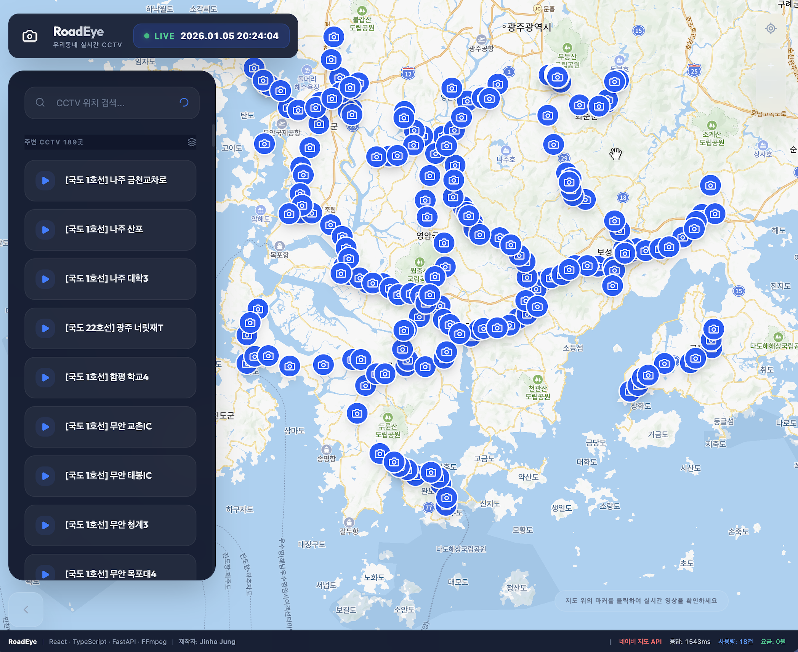
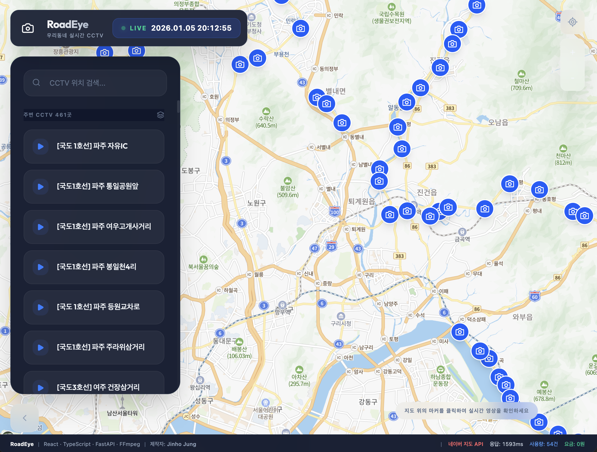
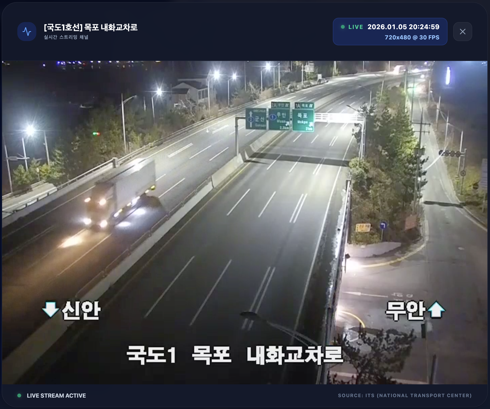
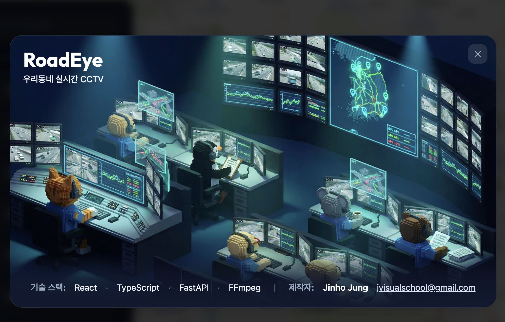

# 🎥 RoadEye - 우리동네 실시간 CCTV

> **대한민국 전역의 실시간 교통 CCTV를 지도로 확인하고 스트리밍하는 스마트 관제 시스템**

RoadEye는 국가교통정보센터(ITS)의 공공 데이터를 활용하여 사용자의 현재 위치나 선택한 지역의 CCTV 영상을 실시간으로 제공합니다. 현대적인 인터페이스와 강력한 스트리밍 처리 기술을 결합하여 보안 정책(Mixed Content) 문제를 해결한 쾌적한 시청 환경을 제공합니다.

---

## ✨ 주요 기능

- **🗺️ 실시간 인터랙티브 지도**: 네이버 지도 API를 기반으로 내 주변의 CCTV 위치를 마커로 표시합니다.
- **🔍 스마트 위치 검색**: 특정 지역명을 검색하여 해당 지역의 CCTV 목록을 쉽고 빠르게 찾을 수 있습니다.
- **📺 실시간 HLS 스트리밍**: 
  - 저지연 HLS(HTTP Live Streaming) 기술 적용
  - 보안 프로토콜(HTTP/HTTPS) 혼합 문제를 해결하기 위한 백엔드 스트리밍 프록시 내장
- **📊 API 사용량 모니터링**: 지도 API의 실시간 호출 건수 및 예상 비용을 투명하게 공개합니다.
- **📱 반응형 프리미엄 디자인**: Glassmorphism 디자인과 Framer Motion을 활용한 부드러운 애니메이션 UI를 제공합니다.

---

## 📸 서비스 스크린샷

<p align="center">
  
  
</p>
<p align="center">
  
  
</p>

---

## 🛠️ 기술 스택 (Tech Stack)

### Frontend
- **Framework**: React 18, TypeScript, Vite
- **Styling**: Vanilla CSS, TailwindCSS (for utility classes)
- **Animation**: Framer Motion
- **Icons**: Lucide React
- **Map**: Naver Maps JavaScript API v3
- **Video Player**: Video.js (HLS support)

### Backend
- **Framework**: Python 3.10+, FastAPI
- **Streaming Handlers**: FFmpeg (Process Management)
- **Communication**: Httpx (Async HTTP Client)
- **Deployment**: Apache, Systemd

---

## 🚀 시작하기

### 1. 환경 변수 설정
루트 디렉토리에 `.env` 파일을 생성하고 다음 정보를 입력합니다.
```env
ITS_API_KEY=여러분의_ITS_공공데이터_인증키
```

### 2. 백엔드 실행
```bash
cd backend
python -m venv venv
source venv/bin/activate  # Windows: venv\Scripts\activate
pip install -r requirements.txt
uvicorn app.main:app --host 0.0.0.0 --port 8000 --reload
```

### 3. 프론트엔드 실행
```bash
cd frontend
npm install
npm run dev
```

---

## 🛡️ 보안 관리

- **API 키 보호**: 공공데이터 인증키는 서버측 `.env`에서 관리하며 클라이언트에 노출되지 않습니다.
- **지도 보안**: 네이버 지도 Client ID는 등록된 특정 도메인(Referer)에서만 작동하도록 화이트리스트 설정이 적용되어 있습니다.
- **스트리밍 보안**: 세션별 FFmpeg 프로세스 관리 및 종료 이벤트를 통해 서버 자원 낭비를 방지합니다.

---

## 📄 라이선스 및 제작 정보

- **제작자**: Jinho Jung ([jvisualschool@gmail.com](mailto:jvisualschool@gmail.com))
- **데이터 출처**: 국가교통정보센터(ITS) 공공데이터 API
- **해당 프로젝트는 비상업적 학습 및 포트폴리오 목적으로 제작되었습니다.**
